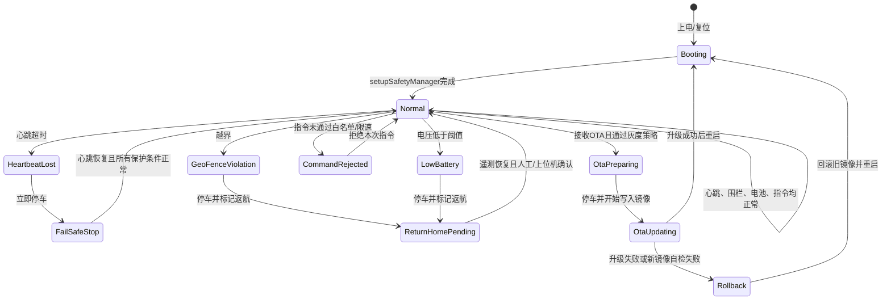
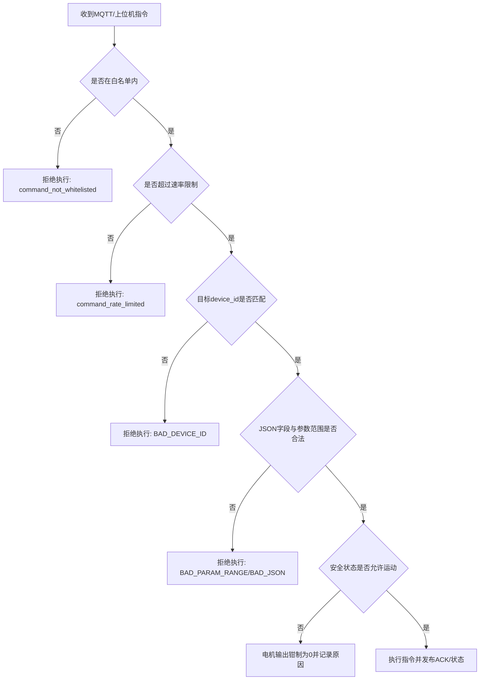
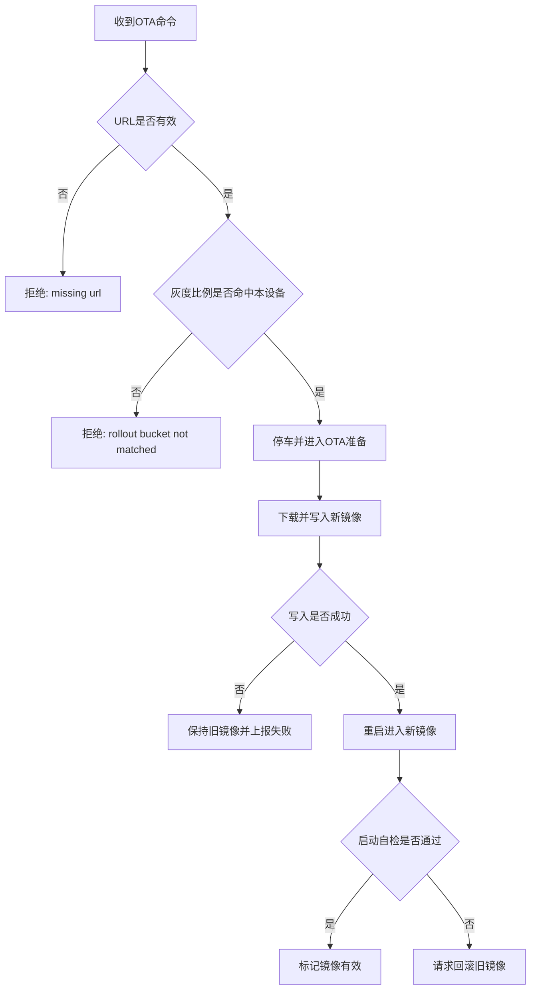

# 可靠性与安全机制说明

本分支补充船端 Fail-safe 安全保护框架，面向 ESP32-S3 智能船舶控制系统已有的 WiFi 重连、4G 兜底、MQTT 指令、重启与 OTA 基础能力，新增统一安全管理模块 `safety_manager`，并将安全总闸接入主循环、电机输出和自动导航差速控制。

## 已补充内容

### 1. 心跳超时停车

`safety_manager` 维护 `lastHeartbeatMs` 和 `SAFETY_HEARTBEAT_TIMEOUT_MS`。当控制端心跳超时后，系统会进入 fail-safe 状态并立即调用电机停车逻辑，将左右电机 PWM 输出置零。该机制用于处理上位机断开、MQTT 掉线、WiFi/4G 链路异常、控制端程序崩溃等情况。

默认超时时间为 3000 ms，可通过 PlatformIO build flags 覆盖：

```ini
-DSAFETY_HEARTBEAT_TIMEOUT_MS=3000
```

### 2. 地理围栏越界保护

新增圆形地理围栏接口：

- `safetySetHome(latitude, longitude)`：设置返航/安全中心点；
- `safetySetGeoFence(centerLatitude, centerLongitude, radiusMeters)`：设置围栏中心和半径；
- `safetyEnableGeoFence(true/false)`：启停围栏保护；
- `safetyUpdateTelemetry(latitude, longitude, batteryVoltage)`：更新定位和电池遥测。

当定位有效且设备距离围栏中心超过半径时，系统会触发 `geofence_violation`，停车并进入返航标记状态。未接 GPS 时默认不误触发，便于分阶段接入真实定位模块。

### 3. 电量低返航保护

安全模块预留电源监测入口，默认低电阈值为 6.80 V：

```ini
-DSAFETY_LOW_BATTERY_VOLTAGE=6.80
```

当 `safetyUpdateTelemetry()` 传入的电压低于阈值后，系统会触发 `low_battery_return_home`，停止当前电机输出并设置 `returningHome=true`。目前代码层面完成低电保护与返航状态切换，后续可在任务执行器中根据 `returningHome` 接入 GPS 返航路径规划。

### 4. OTA 灰度发布与回滚镜像

新增 OTA 灰度判断和回滚接口：

- `safetyShouldAcceptOta(rolloutPercent)`：按设备 ID 稳定散列到 0~99 分桶，仅允许命中灰度比例的设备升级；
- `safetyPrepareOta(rollbackAllowed)`：升级前停车并记录是否允许回滚；
- `safetyMarkBootSuccessful()`：新固件启动后标记镜像有效，取消回滚挂起；
- `safetyRequestRollback(reason)`：请求回滚并重启。

该部分基于 ESP-IDF OTA 回滚接口实现，实际回滚效果依赖分区表和 bootloader 是否启用 app rollback 支持。

### 5. 指令白名单与速率限制

`safetyAcceptCommand()` 提供统一指令白名单和限速判断，当前内置白名单包括：

- `heartbeat`
- `legacy_motor`
- `legacy_navigation`
- `legacy_ota`
- `legacy_restart`
- `legacy_shutdown`
- `motor`
- `nav_mode`
- `mission`
- `ota`
- `restart`
- `safety`

默认最小指令间隔为 80 ms，可通过 build flags 覆盖：

```ini
-DSAFETY_COMMAND_MIN_INTERVAL_MS=80
```

### 6. 电机输出安全总闸

`motor_control()` 中加入了非零 PWM 的安全总闸：只要 `safetyAllowsMotion()` 返回 false，所有非零电机输出都会被钳制为 0。停车指令本身不会被拦截，避免 fail-safe 触发停车时出现递归阻塞。

红外自动导航 `motor_control_ir_auto()` 和 `motor_control_ir_navigation()` 也在差速计算后调用 `safetyGuardMotorCommand()`，确保自动导航输出同样受心跳、围栏和电池保护约束。

## 状态机设计

### 1. Fail-safe 总体状态机



该状态机以 `safetyLoop()` 为核心周期巡检入口，以 `motor_control()` 的安全总闸作为最后保护层。正常状态下系统允许手动控制、红外导航和任务模式运行；一旦心跳、电池、围栏任一条件异常，系统会优先停车，再根据异常原因进入 Fail-safe 停车或返航待处理状态。

### 2. 指令处理状态机



该流程用于说明指令进入系统后的多级过滤顺序：先过滤指令类型，再做频率控制，然后检查设备目标与参数合法性，最后由安全总闸决定是否允许产生电机输出。

### 3. OTA 灰度与回滚状态机



## 关键算法伪代码

### 1. 安全巡检主循环

```text
Algorithm safetyLoop
Input: lastHeartbeatMs, batteryVoltage, currentPosition, geofenceConfig
Output: safetyStatus, motorStopAction

1. now <- millis()
2. if now - lastHeartbeatMs > HEARTBEAT_TIMEOUT then
3.     heartbeatOk <- false
4.     stopMotors("heartbeat_timeout")
5. else
6.     heartbeatOk <- true
7. end if

8. if batteryVoltage is valid and batteryVoltage < LOW_BATTERY_VOLTAGE then
9.     batteryOk <- false
10.    returningHome <- true
11.    stopMotors("low_battery_return_home")
12. else
13.    batteryOk <- true
14. end if

15. if geofenceEnabled and currentPosition is valid then
16.    distance <- haversine(currentPosition, fenceCenter)
17.    if distance > fenceRadius then
18.        geofenceOk <- false
19.        returningHome <- true
20.        stopMotors("geofence_violation")
21.    else
22.        geofenceOk <- true
23.    end if
24. end if

25. if heartbeatOk and batteryOk and geofenceOk and commandOk then
26.    failSafeActive <- false
27. else
28.    failSafeActive <- true
29. end if
```

### 2. 电机输出安全钳制

```text
Algorithm safetyGuardMotorCommand
Input: leftPwm, rightPwm, safetyStatus
Output: guardedLeftPwm, guardedRightPwm, allowed

1. call safetyLoop()
2. if failSafeActive == true or heartbeatOk == false or batteryOk == false or geofenceOk == false then
3.     guardedLeftPwm <- 0
4.     guardedRightPwm <- 0
5.     allowed <- false
6. else
7.     guardedLeftPwm <- constrain(leftPwm, -255, 255)
8.     guardedRightPwm <- constrain(rightPwm, -255, 255)
9.     allowed <- true
10. end if
11. return allowed
```

### 3. 地理围栏判断算法

```text
Algorithm checkGeoFence
Input: currentLatitude, currentLongitude, centerLatitude, centerLongitude, radiusMeters
Output: geofenceOk

1. if geofence is disabled then return true
2. if current position is invalid then return true
3. dLat <- radians(currentLatitude - centerLatitude)
4. dLon <- radians(currentLongitude - centerLongitude)
5. a <- sin(dLat/2)^2 + cos(radians(centerLatitude)) * cos(radians(currentLatitude)) * sin(dLon/2)^2
6. c <- 2 * atan2(sqrt(a), sqrt(1-a))
7. distance <- EARTH_RADIUS_METERS * c
8. if distance > radiusMeters then
9.     return false
10. else
11.    return true
12. end if
```

### 4. 指令白名单与速率限制

```text
Algorithm safetyAcceptCommand
Input: commandKey, lastAcceptedTimeMap, whitelist
Output: accepted, rejectReason

1. if commandKey not in whitelist then
2.     accepted <- false
3.     rejectReason <- "command_not_whitelisted"
4.     return
5. end if

6. now <- millis()
7. last <- lastAcceptedTimeMap[commandKey]
8. if now - last < COMMAND_MIN_INTERVAL_MS then
9.     accepted <- false
10.    rejectReason <- "command_rate_limited"
11.    return
12. end if

13. lastAcceptedTimeMap[commandKey] <- now
14. accepted <- true
15. rejectReason <- ""
```

### 5. OTA 灰度分桶算法

```text
Algorithm safetyShouldAcceptOta
Input: deviceId, rolloutPercent
Output: accepted

1. percent <- constrain(rolloutPercent, 0, 100)
2. hash <- FNV1a(deviceId)
3. bucket <- hash mod 100
4. if bucket < percent then
5.     accepted <- true
6. else
7.     accepted <- false
8. end if
9. return accepted
```

## 实验数据记录预留位置

### 1. 心跳超时停车实验记录

| 实验编号 | 测试日期 | 心跳周期/ms | 设置超时/ms | 断开心跳时间 | 实际停车延迟/ms | 左电机最终PWM | 右电机最终PWM | 是否触发Fail-safe | 备注 |
|---|---|---:|---:|---|---:|---:|---:|---|---|
| HB-01 |  |  | 3000 |  |  | 0 | 0 |  |  |
| HB-02 |  |  | 3000 |  |  | 0 | 0 |  |  |
| HB-03 |  |  | 3000 |  |  | 0 | 0 |  |  |

### 2. 地理围栏越界保护实验记录

| 实验编号 | 测试日期 | 围栏中心坐标 | 围栏半径/m | 测试点坐标 | 计算距离/m | 期望结果 | 实际结果 | 电机是否停车 | 备注 |
|---|---|---|---:|---|---:|---|---|---|---|
| GF-01 |  |  | 120 |  |  | 围栏内允许运行 |  |  |  |
| GF-02 |  |  | 120 |  |  | 越界停车 |  |  |  |
| GF-03 |  |  | 120 |  |  | 越界停车并标记返航 |  |  |  |

### 3. 电量低返航实验记录

| 实验编号 | 测试日期 | 输入电压/V | 低电阈值/V | 初始模式 | 期望结果 | 实际结果 | returningHome状态 | last_stop_reason | 备注 |
|---|---|---:|---:|---|---|---|---|---|---|
| BAT-01 |  | 7.40 | 6.80 | 手动 | 正常运行 |  | false |  |  |
| BAT-02 |  | 6.70 | 6.80 | 手动 | 停车并标记返航 |  | true | low_battery_return_home |  |
| BAT-03 |  | 6.50 | 6.80 | 自动导航 | 停车并标记返航 |  | true | low_battery_return_home |  |

### 4. OTA 灰度与回滚实验记录

| 实验编号 | 测试日期 | device_id | rolloutPercent | bucket | 是否命中灰度 | OTA URL | 下载结果 | 新镜像启动结果 | 是否回滚 | 备注 |
|---|---|---|---:|---:|---|---|---|---|---|---|
| OTA-01 |  |  | 10 |  |  |  |  |  |  |  |
| OTA-02 |  |  | 50 |  |  |  |  |  |  |  |
| OTA-03 |  |  | 100 |  | 是 |  |  |  |  |  |

### 5. 指令白名单与速率限制实验记录

| 实验编号 | 测试日期 | 指令类型 | 指令间隔/ms | 是否在白名单 | 期望结果 | 实际结果 | rejectReason | 备注 |
|---|---|---|---:|---|---|---|---|---|
| CMD-01 |  | motor | 100 | 是 | 接受 |  |  |  |
| CMD-02 |  | motor | 20 | 是 | 限速拒绝 |  | command_rate_limited |  |
| CMD-03 |  | unknown_cmd | 100 | 否 | 白名单拒绝 |  | command_not_whitelisted |  |

### 6. 综合安全联调记录

| 实验编号 | 测试日期 | 场景描述 | 初始模式 | 触发条件 | 期望状态迁移 | 实际状态迁移 | MQTT状态上报是否正常 | 结论 | 备注 |
|---|---|---|---|---|---|---|---|---|---|
| SYS-01 |  | 手动航行中心跳中断 | 手动 | 心跳超时 | Normal -> FailSafeStop |  |  |  |  |
| SYS-02 |  | 自动导航越界 | 红外导航 | GPS越界 | Normal -> ReturnHomePending |  |  |  |  |
| SYS-03 |  | OTA升级前停车 | 手动 | OTA命令 | Normal -> OtaPreparing -> OtaUpdating |  |  |  |  |

## 状态上报

安全模块提供 `safetyStatusJson()`，可生成以下关键字段：

- `heartbeat_ok`
- `geofence_ok`
- `battery_ok`
- `command_ok`
- `fail_safe_active`
- `returning_home`
- `battery_voltage`
- `latitude`
- `longitude`
- `last_stop_reason`
- `geofence_enabled`
- `geofence_radius_m`

可在 MQTT 侧发布到 `/sbn/v1/{device_id}/state/safety`，供上位机展示。

## 当前接入点

- `src/main.cpp`：启动阶段初始化安全模块，循环阶段执行 `safetyLoop()`；
- `src/motor_control.cpp`：所有非零电机输出经过安全总闸；
- `include/safety_manager.h` / `src/safety_manager.cpp`：实现 Fail-safe 状态机、围栏、低电、灰度 OTA、回滚和指令限速。

